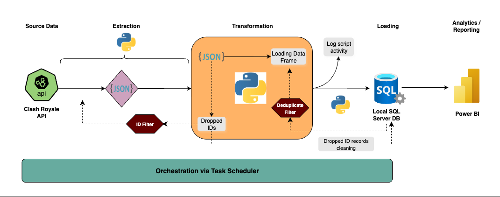
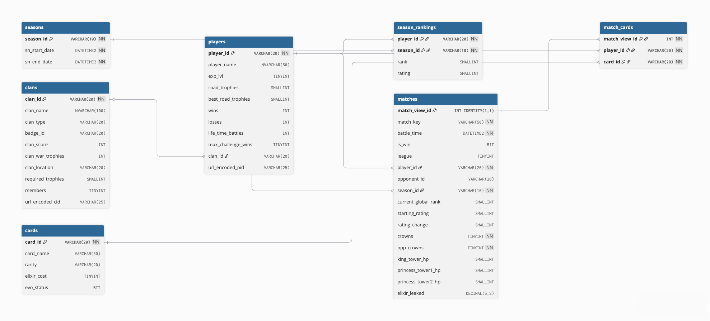

# Clash Royale Data Pipeline Project

## Introduction

This project is a fully automated data pipeline that extracts, transforms, and loads real-time Clash Royale gameplay data from top players into an on-prem SQL Server database, enabling in-depth performance and meta analysis. 

The data is pulled from the [Official Clash Royale API](https://developer.clashroyale.com/#/getting-started), which provides free access to game data across all players and modes.

This project builds on an [earlier analytics work](https://github.com/Yishak-Ali/Clash-Royale-API-Data-Analysis) using the same API - this time with a focus on end-to-end data engineering. It features a full-stack ETL pipeline, a robust relational database schema, automated daily ingestion, and dynamic error handling for smooth data flow.

## Features

- **Automated ETL Pipeline**: fully automated extraction, transformation, and loading of game data using Python and Windows Task Scheduler set to run twice a day.

- **Dynamic Error Handling and Logging**: structured logging system captures ETL activity and errors, ensuring pipeline reliability.

- **Modular Codebase for Reusability**: cleanly separated Python modules for API pulls, helper functions, and SQL operations allow easy maintenance and future expansion.

- **Pre-Load Duplicate Detection and Filtering**: ensures only new, unique data are loaded by checking for existing records in database prior to inserts.
  
- **Normalized SQL Server Schema**: clean relational schema with foreign keys, indexes, stored procedures, and views for efficient storage and querying.

- **Deck and Meta Tracking**: tracks top player decks, card usage frequency, and battle outcomes to drive meta analysis.

- **Historical Data Storage**: retains game logs and maintains player data updates over time to support trend analysis and more informed analytics.

## Tech Stack
- Python:
    - pandas
    - sqlalchemy
    - requests
    - logging
- SQL Server
- Visual Studio Code
- Task Scheduler

## ETL Architecture 
**Pipeline Diagram:**

1. **Source Data**: Clash Royale API serves as the data source, providing JSON responses for relevant data associated with tracked top players (past top 100 ranked / Path of Legends season finishers).

2. **Extraction**: Python scripts send requests to the API and parse the JSON data.
A dynamic player ID filter removes known terminated or banned players before proceeding to transformation.

3. **Transformation**: JSON responses are normalized and processed into a structured DataFrame. A deduplication filter ensures no duplicate records are stored. Newly failed player ID pings (terminated or banned players) are logged into a blacklist, preventing failed pings to API on subsequent runs.

4. **Loading**: Cleaned data is loaded into a local SQL Server database via SQLAlchemy. Any existing database records associated with failed players are purged. A logging mechanism records script activity, status, and errors for traceability.

5. **Orchestration**: Task Scheduler orchestrates the entire ETL script to run twice a day, ensuring timely data updates without manual intervention.

6. **Analytics / Reporting**: Power BI connects to the SQL database to visualize deck trends, player performance, and battle meta.

## Database Schema
**Entity Relationship Diagram**:

**Core Tables**:
- players: tracked player info
- matches: 1v1 ranked matches log
- cards: master card data
- match_cards: player decks used in matches
- season_rankings: final player standings by season
- seasons: tracked ranked seasons
- clans: clan data for top players

## How to Use
1. Clone the repository.
2. Connect to your SQL Server instance and run the [data base creation script](https://github.com/Yishak-Ali/CR-Data-Pipeline-Project/blob/main/sql/db_creation_script.sql) with your GUI of choice.
3. Create a python virtual environment (optional but recommended):

        python -m venv venv 
        
        # Activate on Windows:
        venv\Scripts\activate

        # or on Linux/macOS:
        source venv/bin/activate

 4. Install all required Python packages:
        
        pip install -r requirements.txt

5. Make sure your system ODBC drivers are installed (project uses ODBC Driver 17):

        # Linux: 
        sudo apt install unixodbc-dev

        # Windows: 
        https://learn.microsoft.com/en-us/sql/connect/odbc/download-odbc-driver-for-sql-server?view=sql-server-ver17

6. Obtain a Clash Royale API key [here](https://developer.clashroyale.com/#/getting-started).

7. Create a .py file named config.py and a .json file named config.json in the [configs directory](https://github.com/Yishak-Ali/CR-Data-Pipeline-Project/tree/main/configs) of repo.

        write to config.py: API_KEY = {'Key':'your_api_key_here'}

        write to config.json: {'server': 'your_server',
                               'database': 'clash_royale',
                               'username': 'your_username',
                               'password': 'your_password",
                              }
8. From the project root directory, run the ETL script manually:

        python etl_pipeline_script.py

9. Optionally, schedule automated runs of etl_pipeline_script.py via Task Scheduler or your preferred scheduler.

## Limitations & Future Work